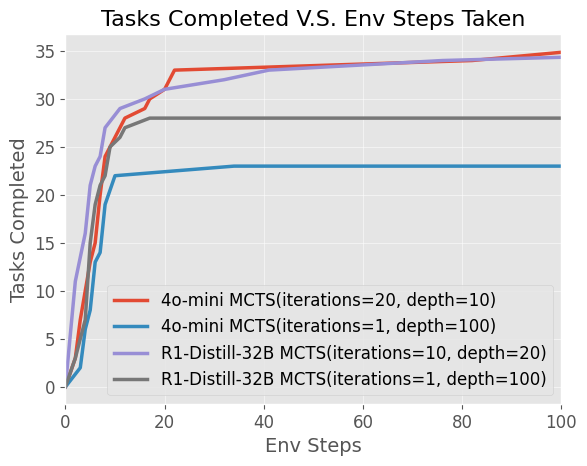

# Multi-Modal LLM Reasoning and Agent Modeling

Trevan Nguyen, Nathaniel Del Rosario, Aaryan Agrawal, Zihan Liu, Samuel Zhang, Zhiting Hu

## Demo

[Twitter Release Post](https://x.com/MaitrixOrg/status/1870222460051960145)

<iframe width="100%" height="400" src="https://www.youtube.com/embed/h1ILgb-8Mvo" frameborder="0" allowfullscreen></iframe>

## Introduction

The web is an expansive and dynamic environment, hosting an immense wealth of information and variety in user interfaces. As the digital world has become an integral component of our world, automating interactions with the web has become an increasingly compelling goal. Web agents hold the promise of transforming how we fundamentally interact with online platforms. These agents could streamline workflows, assist in research, facilitate accessibility, and even execute complex multi-step tasks across different websites.

A key challenge in developing effective web agents lies in their ability to generalize across diverse web environments. Unlike domain-specific automation tools, such as web scrapers or task-specific scripts/extensions, a robust web agent must handle an open-ended action space, reasoning through arbitrary interfaces much like a human user would. This involves interpreting webpage structures, making decisions based on evolving states, and recovering from errors when unexpected behaviors arise.

Recent advances in large language models (LLMs) have significantly improved the viability of web agents. By leveraging LLMs’ ability to process textual and structural web data, along with prompting techniques such as Tree of Thought prompting (Yao 2024), these agents can be guided by high-level reasoning rather than rigid scripts. However, as shown in works such as Tree Search for Language Model Agents (Koh 2024), even the most capable LLM-based agents face substantial obstacles, such as the complexity of web environments, the vast possible action space, and the difficulty of handling long-horizon tasks where errors compound over time. Increasing the computation available to an LLM agent can naturally increase the performance, however, **_the question remains of how best to scale inference time compute._**

Web/OS-based agents using LLMs show promise in automating browser and operating system tasks, but scaling inference efficiently remains a challenge. This work explores the question of how best to structure search: implicit (greedy, depth-limited) or explicit (structured exploration like MCTS). Implicit search is potentially computationally cheaper but struggles with backtracking, while explicit search enables efficient exploration but relies on resettable states, which may be impractical in real-world web environments. Experiments on 106 WebArena and 50 OSWorld tasks show explicit search achieves higher task completion rates and better environment interaction efficiency. While explicit search excels in controlled settings, implicit search remains more applicable to real-world tasks. Another aspect to consider is conducting an explicit search on an LLM world model, where the search occurs over predicted next states as opposed to the environment itself, which can potentially gain the benefits of both implicit and explicit search. 

## Methods - LLM-Reasoners

[LLM-Reasoners](https://www.llm-reasoners.net/) (Hao 2024) is a standardized, library for creating reasoning agents with a modular framework for customizing the LLM, search algorithm, search configuration, world model, and benchmark architecture. We leverage LLM-Reasoners to investigate this behavior in Monte Carlo Tree Search (MCTS) scaling experiments on the BrowserGym and OSWorld benchmarks. 

## Methods - Browsergym

**Browsergym**

Browsergym (Chezelles 2024) is the primary environment that we are focusing on. Browsergym essentially provides an OpenAI gym-like environment (Brockman 2016) for the web browser. The env object takes in an action represented as code and provides an observation at each step. By utilizing the browsergym library, we can test the performance of our web agent on two key browser task benchmarks: WebArena (Zhou 2023) and Assistantbench (Yoran 2024).

  

**Actions**

How the action is represented is something that can be slightly finicky. Since browsergym is built off of playwright, the action is going to eventually be JavaScript code that is executed to interact with the DOM. The space of all possible JavaScript code is a massive action space, and allowing an agent to directly interact with this space creates an correspondingly massive search space. Setting aside issues with search complexity and code correctness, fundamentally all of the tasks that such an agent would be expected to solve, would be doable with the action space available to the average human end user, i.e. just a keyboard and mouse.

For this reason, functions have been predefined for actions such as `click`, `fill`, `go\_back`, `go\_forward`, etc. While the environment can accept arbitrary code, the agent has been instructed to only provide a specific set of function calls constrained to a "human" action space.

**Observations**

After an action is used to step the environment, an observation is returned. This observation is also provided upon the environment instantiation. By default it contains the page HTML, AXTree, and a screenshot of the current state. Directly passing in all of this information into the context of an LLM, especially the HTML, seems to lead to a significant amount of noise, and degrades performance. For a webpage such as Reddit, the HTML you'd get from the homepage can easily be hundreds or even thousands of lines long. If the first step of your task is just to use the search bar to look for a specific subreddit, 99\%+ of the elements will be irrelevant. The same to some extent also applies to the accessibility tree, however, the AXTree being a significantly more compact representation, takes up significantly less context. Only the AXTree ends up being passed into LLM context.

For screenshots, since current LLMs tend to struggle with grounding, the screenshots are further augmented with a set of marks (SoM) (Yang 2023).

**Search**

At every step, a single action can be taken to expand into a new state. For a given task, there can often be over a dozen steps needed to reach completion. If there's a situation where the first ten steps are correct, but a minor mistake is made on the eleventh step, the task would become in-completable without backtracking.

  

**Implicit Search on the Environment**

You could backtrack by relying on the LLM agent to undo it's action, i.e. if a subscribe button is clicked, it would then click the unsubscribe button to undo it. However, if the LLM clicked a button which brings up a modal form, where it's still on the same page, then to close the modal, the LLM sends the go_back action, which navigates to the previous page, then while it has closed the modal, it has gone back too far and failed it's backtrack. While such scenarios should be recoverable, empirically speaking, the LLM struggles to do so, and task execution becomes messy.

**Explicit Search on the Environment**

An alternative would be relying on a search algorithm, such as MCTS, to do backtracking for you. In an arbitrary environment, this could involve resetting the environment, then replaying all actions, but in the web case, you can do something more sophisticated with caching and reloading web pages. Having an explicit search algorithm like MCTS also provides other benefits in that an LLM doesn't need to identify the correct backtrack and subsequent next node to end up finding the correct trajectory.

Under an explicit search algorithm like MCTS, at every step when expanding a node, the LLM is re-prompted to generate hundreds of possible next actions, i.e. new nodes. Then another LLM can generate an evaluation of each action, so that the rollout isn't random. These evaluations can then be used to influence the subsequent Q-values and guide exploration.

It should be noted that a strong assumption is being made here that backtracking would be possible. In any situation where you are writing information to some external server that you don't control, you run the risk of a backtrack failing. Simply reloading a cached client state will not reset the server state. If a bank transfer is made on something like Zelle, and then you want to backtrack from that state, you cannot do so.

This does make implicitly searching on the environment preferable to explicitly doing so in many cases, as there is no dependence on such an assisted backtrack. Comparing the performance of these two would be interesting.

**Comparing Explicit and Implicit Environment Search**

Implicit search is essentially greedy search, and greedy search can be represented through MCTS with only a single iteration. Visitation statistics do not accumulate, so the only information being used to decide which node to expand next is the LLM evaluation of an action (fast reward). Implicit search will be implemented as MCTS(depth=..., iterations=1).

When it comes to comparing explicit search and implicit search and how they scale, implicit search can only be scaled by increasing the depth. A nice property is that when running to evaluate performance on a depth 100 implicit search, you can just ignore the later portions of trajectories to get results for all depths before 100. For gathering data on how implicit search scales, a single run of "MCTS" at MCTS(depth=100, iterations=1) will be sufficient.

For explicit search, there does not exist this same property for depth. If you have a 10 iteration 20 depth tree result for a task, if for the first iteration it reaches task completion on depth 15, then the search would end leading to no second iteration. If you try to extrapolate a 10 iteration 10 depth run from this data, you would not be able to do so. However, that does not mean that a 10 iteration 10 depth tree is incapable of also finding a viable solution. You have to do a separate run to find out.

However, for explicit search and iterations, such a convenient property does exist. Through ignoring the later iterations a 10 iteration 20 depth experiment would inherently provide a run for a 9 iteration 20 depth experiment and so on so forth.

With these bits of information in mind, for explicit search, there will be separate runs which will all share the same number of iterations at 10, but have varying depths of 5, 10, and 20.

With how these experiments are structured, the subsequent search trees can end up being massive. Cost needs to be a considered factor.

  

  

**Cost Analysis**

In the context of browsergym, the benchmark used for these experimental runs will be the webarena benchmark. Of over 800 tasks provided, a subset of 106 tasks will be evaluated on. The main reason for a subset fundamentally comes down to a matter of cost. When running a single example on gpt-4o with MCTS(depth=20, iterations=10), the cost can already easily exceed \$1 USD. Should you evaluate on the entire dataset with gpt-4o, a single run would likely take over \$1000. With 4 runs planned, some of them likely to be far more expensive than \$1 per task, the estimated cost of this entire experiment would likely be more than \$4000.

With a provided key with \$200 of credit, not only is a subset needed, but also a cheaper model. These experiments will be conducted on said subset of 106 tasks, and also utilize gpt-4o-mini instead of gpt-4o, which should further reduce the costs by approximately 15 fold. The number of action proposals at each step will be kept at 10. While it could be set much higher, with a proposal temperature of 0.7, often over half of the proposals end up being duplicate actions. Scaling n proposals at each step is another axis and increasing it to a 100 or more would likely also benefit performance, but that can be explored later. For now, keeping n proposals fixed at 10 should provide enough variety in responses for benefits to be attainable from search.

Despite gpt-4o-mini being a distill of gpt-4o, the scaling results may not necessarily generalize to gpt-4o or other models and should be taken with caution.

For this reason, alongside the axes of iterations and depth, there will be another axis of the LLM used. separate runs will also be performed on other strong open source models to ensure that these findings generalize. The models of interest are Qwen2.5-32B-Instruct, and the deepseek r1 distill onto it. At the time of writing, Qwen 2.5 32B is one of the strongest open source 32B models, so it should be fairly representative. As these models can be hosted locally via fast inference frameworks such as SGLang, the cost should be minimal compared to APIs.

**Search on an Internal World Model**

Another alternative to addressing the backtracking issue in the explicit search on the environment case is to search and backtrack not on the actual environment, but instead on a simulated "LLM dream". On top of having a step function for the browsergym environment, you also have the LLM approximate the results on the step function. This addresses the issue of some actions being irreversible with the downside of becoming dependent on the LLM's ability to "dream" the browser environment accurately. As such, the LLM is considered an Internal (as opposed to the external, real browser environment) World Model (where our "world" is the browser environment).

**Visualizer**

To best support the development of reasoning algorithms, we have directly integrated the improved LLM reasoners visualizer into the AgentLab x-ray tool. Using AgentLab, every action the LLM takes first generates an MCTS tree that is searched for the best outcome. When looking at a run, it is inconvenient to move to a different website to look at the visualizer for each step. Thus, the visualizer is created automatically for each action and embedded directly in the x-ray tool.

**Some Example Visualizer Links: [1](https://www.llm-reasoners.net/visualizer/3d03a5cb-d67a-4f38-bf81-0ca8ec3b28e8?accessKey=f0f4b36b) [2](https://www.llm-reasoners.net/visualizer/96e5f87d-4b70-4e61-8b47-d3fc57879204?accessKey=9f69d408)**

  

**Visualizer Architecture Backend**

  

## Results - Browsergym

**Experiment Results**

| Name                                          | Successes | Failures | Errors |
| --------------------------------------------- | --------- | -------- | ------ |
| 4o-mini MCTS (depth=5, iterations=10)         | 15        | 89       | 2      |
| 4o-mini MCTS (depth=10, iterations=10)        | 21        | 82       | 3      |
| 4o-mini MCTS (depth=20, iterations=10)        | 35        | 67       | 4      |
| 4o-mini MCTS (depth=100, iterations=1)        | 23        | 71       | 4      |
| qwen2.5-32b MCTS (depth=5, iterations=10)     | 8         | 91       | 7      |
| qwen2.5-32b MCTS (depth=10, iterations=10)    | 12        | 85       | 9      |
| qwen2.5-32b MCTS (depth=20, iterations=10)    | 14        | 83       | 9      |
| qwen2.5-32b MCTS (depth=100, iterations=1)    | 9         | 74       | 13     |
| r1-distill-32b MCTS (depth=5, iterations=10)  | 25        | 81       | 0      |
| r1-distill-32b MCTS (depth=10, iterations=10) | 34        | 69       | 3      |
| r1-distill-32b MCTS (depth=20, iterations=10) | 35        | 70       | 1      |
| r1-distill-32b MCTS (depth=100, iterations=1) | 28        | 75       | 3      |

**More Information**

| Name                                          | Success Rate | Total Cost (USD) | Total Time (Hours) |
| --------------------------------------------- | ------------ | ---------------- | ------------------ |
| 4o-mini MCTS (depth=5, iterations=10)         | 0.1415       | 4.86             | 11.3430            |
| 4o-mini MCTS (depth=10, iterations=10)        | 0.1981       | 6.41             | 15.8691            |
| 4o-mini MCTS (depth=20, iterations=10)        | 0.3302       | 9.01             | 25.3912            |
| 4o-mini MCTS (depth=100, iterations=1)        | 0.2347       | 24.35            | 42.0037            |
| qwen2.5-32b MCTS (depth=5, iterations=10)     | 0.0754       | N/A              | 14.1157            |
| qwen2.5-32b MCTS (depth=10, iterations=10)    | 0.1132       | N/A              | 20.3258            |
| qwen2.5-32b MCTS (depth=20, iterations=10)    | 0.1320       | N/A              | 38.5611            |
| qwen2.5-32b MCTS (depth=100, iterations=1)    | 0.0849       | N/A              | 22.3750            |
| r1-distill-32b MCTS (depth=5, iterations=10)  | 0.2358       | N/A              | 50.1258            |
| r1-distill-32b MCTS (depth=10, iterations=10) | 0.3207       | N/A              | 65.4553            |
| r1-distill-32b MCTS (depth=20, iterations=10) | 0.3301       | N/A              | 107.2980           |
| r1-distill-32b MCTS (depth=100, iterations=1) | 0.2641       | N/A              | 172.0004           |

The 4o-mini errors in the table are for when the LLM doesn't follow the required JSON format in it's response. The likelihood an LLM formats incorrectly is small, however, given that a task at depth 100, can end up performing close to a thousand LLM calls through action proposals and evaluations, such parsing errors will manifest. For the future, this can be addressed by redoing the LLM call upon a parse failure.

For the deepseek r1 distill on qwen2.5 32b instruct, these errors are usually due to timeouts from the environment. Another thing to note is that max_response_length has been capped at 8192. Removing the cap, the performance would likely be better, however, the run times would become even longer. Can be explored later.

For the qwen2.5 32b errors, there is likely a bug. The errors are far too high given the baseline of 4o-mini, so the results should be taken with a grain of salt. They are probably lower than they should be.

Next, on the topic of cost, the total cost of the 4o-mini experiments was (4.86 + 6.41 + 9.01 + 24.35) = **$44.63 USD**. Evaluating on the whole dataset would 8x, and evaluating on gpt-4o instead of 4o-mini would 15x leading to an estimated cost of (44.63 \* 8 \* 15) = **$5,355.60 USD**. As expected, that would've been expensive.

Since the deepseek and qwen models are hosted locally, the cost would not be calculated through APIs, but instead through electricity usage. The experiments are run through the "single program multiple data" paradigm (SPMD), so the "Total Time" column would be if running every single task in serial. Though not tracked, it's very likely that the kWh usage was less than that of running an H100 node at full power draw for 24 hours, which would be (0.7kW \* 8 gpus \* 24 hours) = 134.4 kWh. Assuming you can get electricity at 15 cents per kWh, that amounts to approximately \$20 USD.

**Iterations and Depth**

  

Using a single run at MCTS(depth=..., iterations=10), runs at all lower iterations can be extrapolated. As the iterations increase, performance naturally does as well. However, something interesting to note is that most of the task completions occur during the first few iterations. When looking at just the first iteration, at MCTS(depth=5) 13 tasks have been completed, at MCTS(depth=10) 17 tasks have been completed, and at MCTS(depth=20) 29 tasks have been completed. This suggests that depth is important for completing the tasks on webarena, which makes sense. Many tasks in the webarena benchmark are designed to be completed in a little under 10 steps. However, have more depth likely benefits the agent through giving it more room to take suboptimal actions that may still lead towards task completion.

Having a greater depth, also seems to benefit the performance increase from iterations. This also makes sense. Iterations are really only useful so long as the search space available contains a possible correct trajectory. With only 10 iterations, the searchable space isn't that large, which makes having a larger subspace of correct solutions beneficial. So long as the LLM evaluator can roughly "guide" the agent into this subspace, the performance should be better.

On the contrary, if the search space available has only a very narrow subspace of correct trajectories, the search can easily get stuck in a bad subspace and waste its iterations. The total number of tasks is 106, and yet the number of successes in the best case was 35. Almost every single failure ends up going to the maximum iterations, which is to be expected. The majority of the tokens used were on failures. If the agent is using lots of iterations, that's a strong indicator that it's stuck in a bad subspace and likely will fail.

**Comparing Implicit and Explicit Search**

  

For the implicit search, while having a extra depth does help, the returns from depth also do seem to diminish. There are many cases where after depth 20, the agent gets stuck and sends the noop() action 80 times until it hits the depth limit, or it ends up going back and forth between two actions until the depth limit. Similar to the iterations in the explicit search, as the depth increases, if the agent is stuck in a bad subspace, the depth increase won't do much to help.

As a note, in order to compare between the explicit and implicit search scenarios, the x-axis in this chart refers to the number of environment interactions used.

When comparing the two, as expected, since the explicit search is fundamentally designed to address the issue of backtracking difficulties with implicit search, along with an in-built exploration/exploitation trade-off via MCTS, it's hardly surprising that the performance is notably better. However, once again, one of the key advantages of implicit search is that it's usable in real world environments, with potentially constant updates to an external server state.

## Methods - OSWorld

[OSWorld](https://os-world.github.io/) is a desktop environment for evaluating agents on operating system benchmark tasks such as Chrome, VSCode, Gimp, etc. To complete a task, a web agent must take multiple sequential actions. Errors in later steps can make a task irrecoverable without backtracking. Two primary approaches to search are considered: implicit search, where the agent itself attempts to recover from mistakes, and explicit search, where a structured algorithm like Monte Carlo Tree Search (MCTS) assists in decision-making.

<video width="100%" controls>
  <source src="images/change-search-engine.mp4" type="video/mp4">
</video>

- Example OSWorld Task - "Change the default Search Engine"

## Results - OSWorld

In summary, the UITARS-72B model performed substantially better than both 4o-mini and 4o, and in general task success saw an increased correlation with the number of MCTS iterations and depth.

<!--OSWorld Inference/Compute Scaling Plots-->

- Depth of N Scaling

- UITARS-7B through 15 Steps (no MCTS)

- UITARS-72B through 15 Steps (no MCTS)

## Discussion

Web/OS-based agents using LLMs show promise in automating browser tasks, but scaling inference efficiently remains a challenge. This work explores the question of how best to structure search: implicit (greedy, depth-limited) or explicit (structured exploration like MCTS). Implicit search is potentially computationally cheaper but struggles with backtracking, while explicit search enables efficient exploration but relies on resettable states, which may be impractical in real-world web environments. 

Experiments on 106 WebArena and 50 OSWorld tasks show explicit search achieves higher task completion rates and better environment interaction efficiency. While explicit search excels in controlled settings, implicit search remains more applicable to real-world tasks. Another aspect to consider is conducting an explicit search on an LLM world model, where the search occurs over predicted next states as opposed to the environment itself, which can potentially gain the benefits of both implicit and explicit search.

## Conclusion

Web/OS-based agents using LLMs show promise in automating browser tasks, but scaling inference efficiently remains a challenge. This work explores the question of how best to structure search: implicit (greedy, depth-limited) or explicit (structured exploration like MCTS). Implicit search is potentially computationally cheaper but struggles with backtracking, while explicit search enables efficient exploration but relies on resettable states, which may be impractical in real-world web environments. 

Experiments on 106 WebArena and 50 OSWorld tasks show explicit search achieves higher task completion rates and better environment interaction efficiency. While explicit search excels in controlled settings, implicit search remains more applicable to real-world tasks. Another aspect to consider is conducting an explicit search on an LLM world model, where the search occurs over predicted next states as opposed to the environment itself, which can potentially gain the benefits of both implicit and explicit search.

## Acknowledgements

Thank you to our advisor, Professor Zhiting Hu, and his two PhD students, Zhoujun Cheng and Shibo Hao

## References

See our formal [report.](LLM_Reasoning.pdf)
